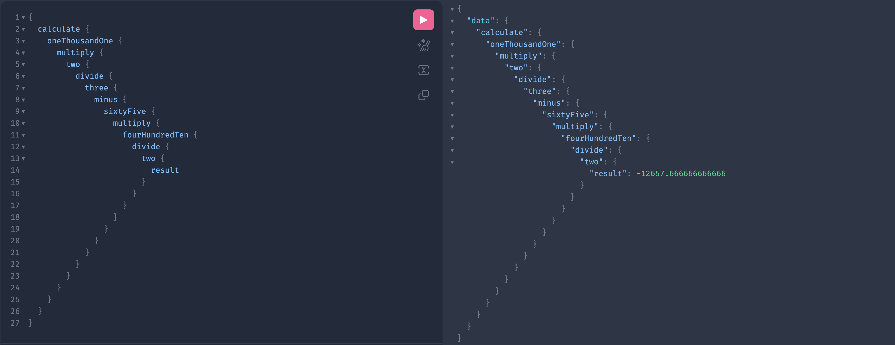

# graphql-calculator

This is an `#GraphQLChallenge`. Simply a dumb POC that I imagined and made. The goal of this challenge is to do a calculator with GraphQL, each node is an operand.

It could be a good exercice to practice the usage of `parent` in graphql and how to resolve a node.

See an exemple here.

